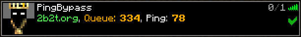

# 3arthh4ck

[](https://www.codefactor.io/repository/github/3arthqu4ke/3arthh4ck/overview/main)
[](https://github.com/3arthqu4ke/3arthh4ck/releases)
[](https://hub.docker.com/r/3arthqu4ke/pingbypass)
[](https://tokei.rs/b1/github/3arthqu4ke/3arthh4ck?category=code)

[](https://github.com/3arthqu4ke/3arthh4ck/actions)

3arthh4ck is a Minecraft 1.12.2 utility mod for anarchy PvP. It can also be used as a proxy server
(replacing the now outdated [PingBypass](https://github.com/3arthqu4ke/PingBypass).) To install it just drop the
[jar](https://github.com/3arthqu4ke/3arthh4ck/releases/latest) into your forge mods folder or use the built-in installer.
The default command prefix is `+`, e.g. to open the gui type `+toggle clickgui`.
Because of bloat I have moved some of the more complicated settings to the Settings module.

## Proxy/PingBypass
  
3arthh4ck can be used as a proxy server. With ping being such an important factor in crystal PvP this allows you to play
on servers far away from you without the disadvantage of high ping, as the server runs its own set of modules.
This proxy can, as opposed to the old PingBypass, stay connected to a server, allowing you to join through it at a later
point. This can for example be used to wait out 2b2t's queue system.

To set up the 3arthh4ck proxy you need a server, I personally started out using [Google Cloud's](https://cloud.google.com/)
free trial. The location of that server should be as close as possible to the one you want to play on. That server should 
have an IP and port which are reachable from the outside. The game will run on that server. Keep in mind that the Minecraft
account on the server will always be used, regardless of the account used on the client.

### Setup with Docker
1.  Install [Docker](https://docs.docker.com/engine/install/) on your server.

2.  Run `docker pull 3arthqu4ke/pingbypass`.

3.  Run `docker run -i -t -p <ip>:<port>:25565 3arthqu4ke/pingbypass`.

4.  You should now be in the shell of the Docker container.

5.  Login to your Microsoft account via `hmc login <email>`, then enter your account password.

6.  Launch the PingBypass server with `hmc launch 1 -id --jvm -Dpb.password=<some password>`.

7.  You are now done with the server setup. Use the commands from
    [HMC-Specifics](https://github.com/3arthqu4ke/HMC-Specifics) to stop the game, or just stop the container.

8.  On your own PC just install 3arthh4ck by dropping it inside your mods folder or by using the built-in installer. 

9.  In the multiplayer menu's top right corner you will see a book and a PingBypass button. Use the PingBypass button to
     toggle it on and off and the book to enter the server's connection details and the password you provided in step 6.

10. You can add the PingBypass server like a normal Minecraft server, which will make it look like in the picture above.
     When the PingBypass button is toggled on you will join any server you click through the PingBypass proxy.

11. The proxy has a seperate set of modules and configs. To manage them toggle the PB-Gui module. 

### Manual Setup with HeadlessMc
This is just what the Docker container already automates.

1.  Install Java 8 on the server.

2.  Create a folder where your game will run.

3.  Inside that folder create two directories: `mods` and `earthhack`.

4.  Put the 3arthh4ck jar and the [HMC-Specifics-1.12.2](https://github.com/3arthqu4ke/HMC-Specifics/releases/tag/1.0.3) 
    jar inside the mods folder.

5.  Inside the earthhack directory create a file called `pingbypass.properties` containing the following:
    ```properties
    pb.server=true
    pb.password=<password for your pingbypass proxy>
    pb.ip=<the aforementioned ip (definitely not 127.0.0.1)>
    pb.port=<the aforementioned port>
    ```

6.  Download [HeadlessMc](https://github.com/3arthqu4ke/HeadlessMc) and run it once.

7.  This should create a file called `HeadlessMC/config.properties`. Edit that file and add:
    ```properties
    hmc.gamedir=<the directory created in step 2.>
    hmc.java.versions=<the Java directory, e.g. /usr/bin/java>
    hmc.invert.jndi.flag=true
    hmc.invert.lookup.flag=true
    hmc.invert.lwjgl.flag=true
    hmc.invert.pauls.flag=true
    ```

8.  Run HeadlessMc again:
    * Login to your Microsoft account with `login <email>`, then enter your password.
    * Run `download 1.12.2`., then `forge 1.12.2`.
    * List the downloaded versions with `versions -refresh`.
    * Launch the game with `launch <id of the forge version> -id`.

9.  You are now done with the server setup. From here you can continue at step 8 in the [Docker setup.](https://github.com/browsky300/3arthh4ck-readme-changes#setup-with-docker) 
